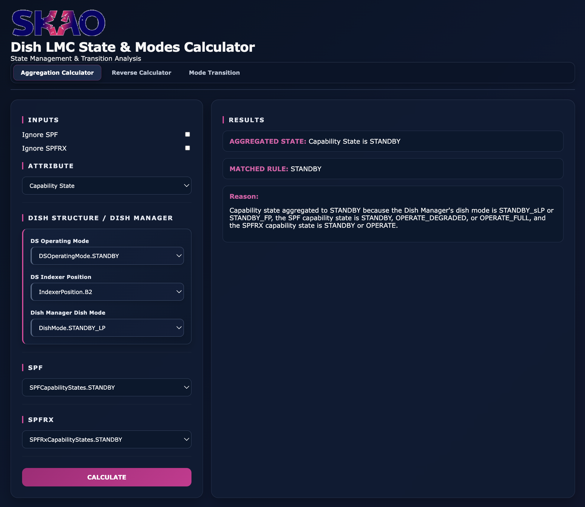
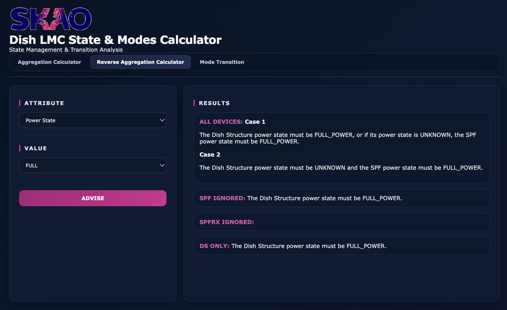
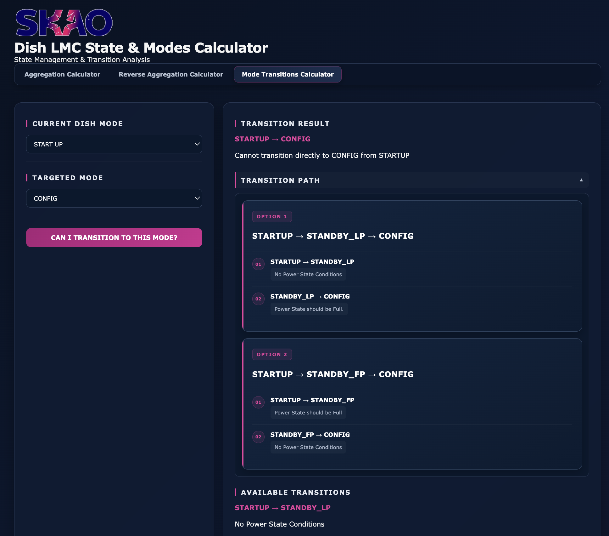

# Dish LMC State & Modes Calculator

A web-based calculator for simulating and analysing Dish LMC states, capabilities, power states, health states, and dish mode transitions.

The calculator provides both **state aggregation** and **reverse advice** functionality, as well as a tool for determining possible transitions between dish modes.

---

## Features

### Simulated Calculator

Calculate the aggregated state of the Dish LMC based on the states of:

- Dish Structure (DS)
- SPF
- SPFRX
- Dish Manager

Supported attributes include:

- Power State
- Capability State
- Health State
- Dish Mode

SPF and SPFRX can also be ignored when required.

### Reverse Calculator

Select a desired state and receive advice on the conditions required to achieve it.

The calculator provides advice for:

- All devices
- SPF ignored
- SPFRX ignored
- Dish Structure only

### Mode Transitions

Check whether a transition between two dish modes is possible.

The Mode Transition calculator provides:

- Direct transition availability
- Transition conditions
- Available transitions from the current mode
- Alternative transition paths when a direct transition is not possible

For example:

    STOW → STANDBY_LP → CONFIG

---

## Screenshots

### Aggregation Calculator

### Reverse Aggregation Calculator

### Mode Transition Calculator

---

## Running the Application

### 1. Create a virtual environment

    python3 -m venv venv

### 2. Activate the virtual environment

**macOS / Linux:**

    source venv/bin/activate

**Windows:**

    venv\Scripts\activate

### 3. Run the application

    uvicorn app.main:app --reload

The application will be available at:

    http://127.0.0.1:8000

### Application Pages

- **Simulated Calculator:** `/`
- **Reverse Calculator:** `/reverse`
- **Mode Transition Calculator:** `/transition`

### Stop the Application

Press `CTRL+C`.

To deactivate the virtual environment:

    deactivate